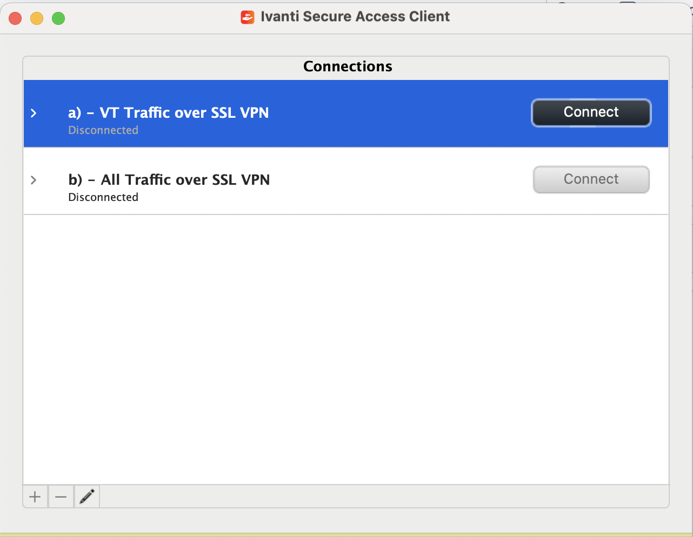
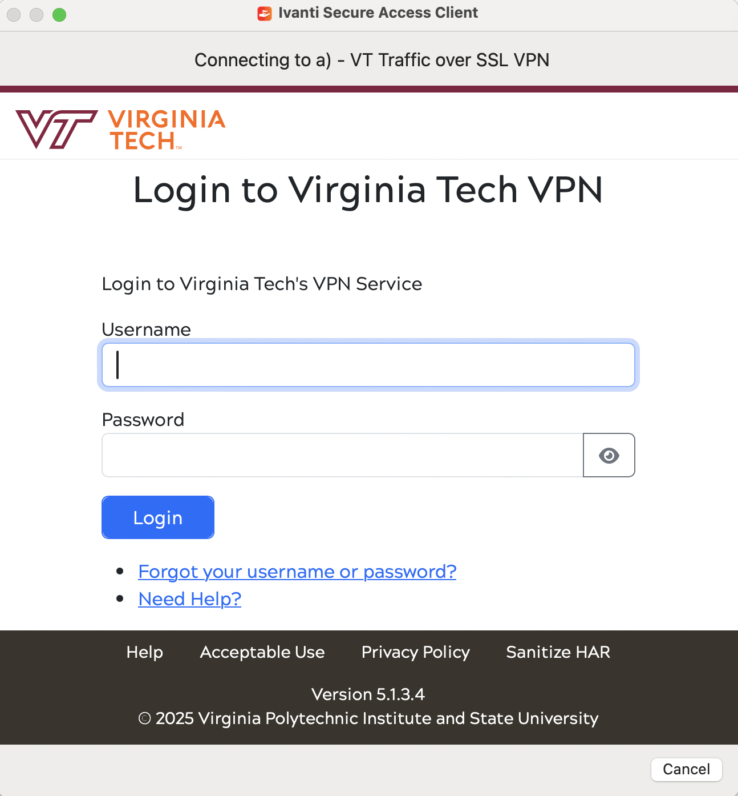
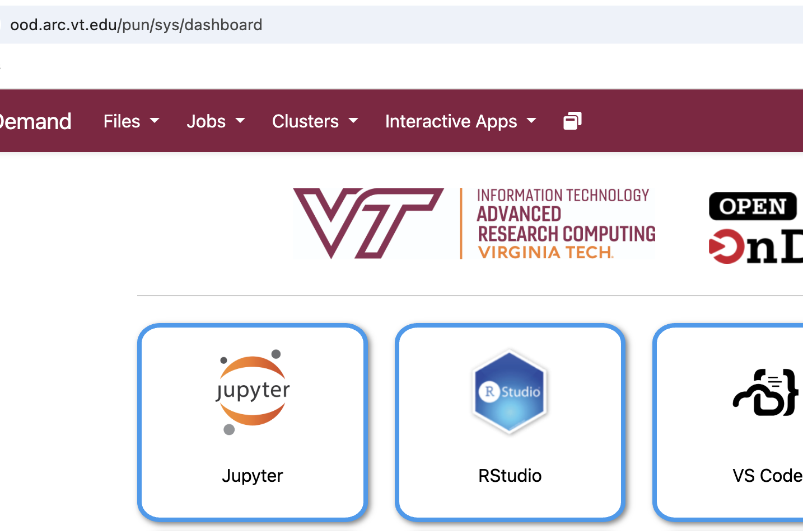
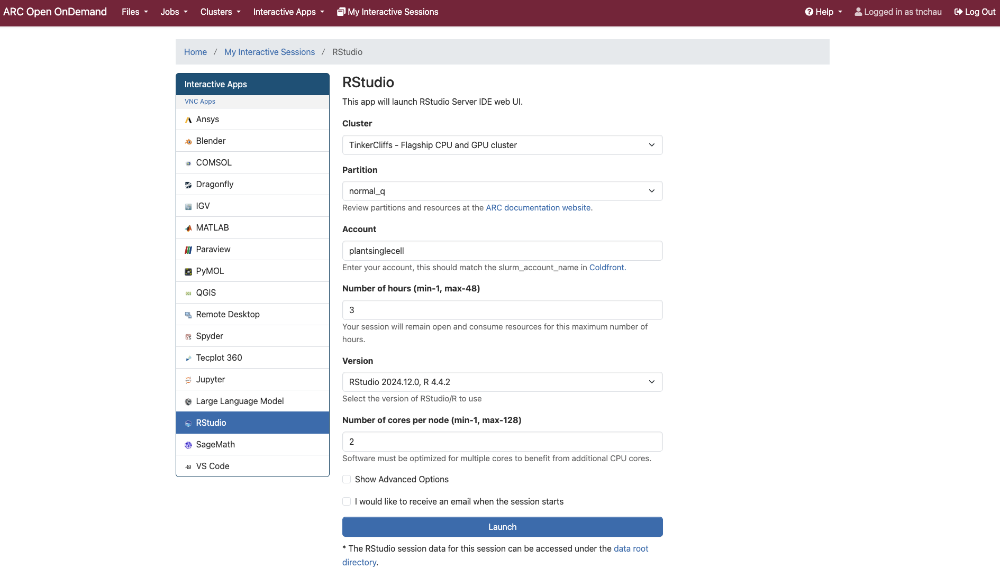

# Launching RStudio via ARC Open OnDemand (Virginia Tech)

This guide walks you through the steps required to access RStudio on the ARC Open OnDemand portal at Virginia Tech.

---

## Step 1: Connect to VPN

Use the **Ivanti Secure Access Client** to connect to the VT VPN.

<!-- Original Markdown -->
<!--  -->

<!-- Updated with smaller size -->

---

## Step 2: Login with VT Credentials

When prompted, enter your **VT PID** as the username and your **VT password**.

---

## Step 3: Open ARC Open OnDemand

Navigate to the following URL in your browser:

[https://ood.arc.vt.edu](https://ood.arc.vt.edu)

This will bring you to the ARC Open OnDemand dashboard.

---

## Step 4: Launch RStudio

From the Open OnDemand dashboard, locate the **RStudio Server** application.

