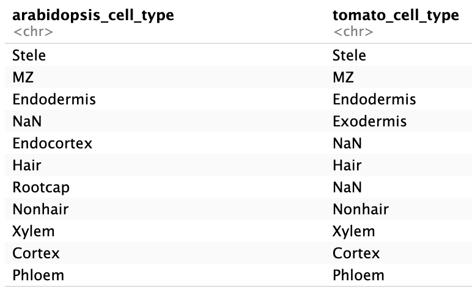

# Apply SATURN to Integrate Plant Single-Cell Data

This guide walks through applying SATURN to integrate Arabidopsis and Tomato single-cell RNA-seq datasets, using protein embeddings and expression profiles.

---

## 🔧 Setup Environment (Falcon cluster)

```bash
module load Miniconda3/24.7.1-0
conda create -n saturn
source activate saturn

# Install packages
conda install python=3.10
pip install -r requirements.txt
pip install torch==1.10.2+cu113 -f https://download.pytorch.org/whl/cu113/torch_stable.html
pip install torch torchvision torchaudio --index-url https://download.pytorch.org/whl/cu118
pip install "numpy<2.0"  #Downgrade Packages for Compatibility
```
> ⏱ Estimated runtime: ~20 minutes


Installing all dependencies can take some time, so I’ve created a preinstalled SATURN environment that you can use directly on ARC without needing to reinstall anything:
```bash
module load Miniconda3/24.7.1-0
source activate /projects/songli_lab/shared_envs/saturn
```


---

## 📥 Download Repository and Prepare Data

```bash
# ✅ Go to the folder where you want to run SATURN
cd /your/desired/path/

# Clone SATURN repo
git clone https://github.com/snap-stanford/SATURN.git

# Create and navigate to proteome directory
cd SATURN/protein_embeddings
mkdir proteome
```

---

## 🧼 Clean FASTA Files

- Remove protein sequences containing stop codons and clean sequence labels.  
- Ensure that each FASTA header includes a `gene_symbol:` tag.

```bash
# ✅ Copy example Arabidopsis FASTA file into your proteome directory
cp /projects/intro2gds/SATURN/protein_embeddings/proteome/Arabidopsis_thaliana.fa proteome/
python clean_fasta.py --data_path proteome/Arabidopsis_thaliana.fa --save_path proteome/Arabidopsis_thaliana.all_clean.fa

# ✅ Copy example Tomato FASTA file into your proteome directory
cp /projects/intro2gds/SATURN/protein_embeddings/proteome/Solanum_lycopersicum.fa proteome/
python clean_fasta.py --data_path proteome/Solanum_lycopersicum.fa --save_path proteome/Solanum_lycopersicum.all_clean.fa
```

---

## ⚡ Extract ESM Embeddings (GPU Needed - Falcon cluster)
- Use the ESM-1b model to generate embeddings for individual protein sequences.
- Each protein's embedding is saved as a `.pt` file.
- The embedding is the mean of the final layer token embeddings.
  
- Running a protein language model requires a GPU.
- Use the GPU cluster on ARC for this task.
- Since it takes time, submit it as a SLURM job.


Download the esm repo.
```bash
git clone https://github.com/facebookresearch/esm.git
```

```bash
cp /projects/intro2gds/SATURN/protein_embeddings/test_slurm.sh .
sbatch test_slurm.sh  # Submit to GPU cluster
```
> ⏱ Estimated runtime: ~18 minutes

In in bash script file you will see
```bash
python esm/scripts/extract.py \
esm1b_t33_650M_UR50S \
proteome/Arabidopsis_thaliana.all_clean.fa \
proteome/embeddings/Arabidopsis_thaliana.all_clean.fa_esm1b \
--include mean

python esm/scripts/extract.py \
esm1b_t33_650M_UR50S \
proteome/Solanum_lycopersicum.all_clean.fa \
proteome/embeddings/Solanum_lycopersicum.all_clean.fa_esm1b \
--include mean
```

To save time, you can use the precomputed ESM-1b embeddings by copying the tested output files directly
```bash
mkdir proteome/embeddings/
cp -r /projects/intro2gds/SATURN/protein_embeddings/embeddings/Solanum_lycopersicum.all_clean.fa_esm1b proteome/embeddings/Solanum_lycopersicum.all_clean.fa_esm1b

cp -r /projects/intro2gds/SATURN/protein_embeddings/embeddings/Arabidopsis_thaliana.all_clean.fa_esm1b proteome/embeddings/Arabidopsis_thaliana.all_clean.fa_esm1b
```
---

## 🔁 Map Gene Symbols to Protein IDs

- Create a mapping from gene symbols to protein IDs.
- This enables efficient lookup of protein embeddings by gene.
  
```bash
# For Arabidopsis
python map_gene_symbol_to_protein_ids.py \
--fasta_path proteome/Arabidopsis_thaliana.fa \
--save_path proteome/Arabidopsis_thaliana.gene_symbol_to_protein_ID.json
```

```bash
# For Tomato
awk '/^>/ {id=substr($0,2); print ">" id " gene_symbol:" id; next} {print}' proteome/Solanum_lycopersicum.all_clean.fa > proteome/Solanum_lycopersicum.fa
python map_gene_symbol_to_protein_ids.py \
--fasta_path proteome/Solanum_lycopersicum.fa \
--save_path proteome/Solanum_lycopersicum.gene_symbol_to_protein_ID.json
```

---

## 🔄 Convert Protein to Gene Embeddings

```bash
# For Arabidopsis
python convert_protein_embeddings_to_gene_embeddings.py \
--embedding_dir proteome/embeddings/Arabidopsis_thaliana.all_clean.fa_esm1b \
--gene_symbol_to_protein_ids_path proteome/Arabidopsis_thaliana.gene_symbol_to_protein_ID.json \
--embedding_model ESM1b \
--save_path proteome/embeddings/Arabidopsis_thaliana.gene_symbol_to_embedding_ESM1b.pt

# For Tomato
python convert_protein_embeddings_to_gene_embeddings.py \
--embedding_dir proteome/embeddings/Solanum_lycopersicum.all_clean.fa_esm1b \
--gene_symbol_to_protein_ids_path proteome/Solanum_lycopersicum.gene_symbol_to_protein_ID.json \
--embedding_model ESM1b \
--save_path proteome/embeddings/Solanum_lycopersicum.gene_symbol_to_embedding_ESM1b.pt
```
> ⏱ Estimated runtime: ~3 minutes


---

## 🧬 Prepare Gene Expression Data

**Expression CSV files:**

Copy the preprocessed expression annotation files provided for Arabidopsis and Tomato
```bash
cd ..
cp /projects/intro2gds/SATURN/data/Arabidopsis_anno.csv data/
cp /projects/intro2gds/SATURN/data/Tomato_anno.csv data/
```
ℹ️ These files contain gene expression matrices with cell-type annotations for Arabidopsis and Tomato.

**Script to convert CSV to AnnData:**

Update the input and output paths in AnnData_plant.py to match your working directory:

file_arabidopsis = "[YOUR_PATH]/SATURN/data/Arabidopsis_anno.csv"
file_tomato = "[YOUR_PATH]/SATURN/data/Tomato_anno.csv"
output_dir = "[YOUR_PATH]/SATURN/data/"

Replace [YOUR_PATH] with the actual path where your SATURN project is located.

```bash
cp /projects/intro2gds/SATURN/data/AnnData_plant.py data/
python data/AnnData_plant.py
```

---
## 🗂️ Optional Cell Type Mapping, if we have the cell type annotation column

This file defines a cross-species cell type mapping between Arabidopsis and Tomato.
```bash
cp /projects/intro2gds/SATURN/data/arabidopsis_tomato_cell_type_map.csv data/
```


<!-- Original Markdown -->
<!--  -->

<!-- Updated with smaller size -->


---

## 📁 Create Saturn Input File

Modify this code with your data path

```python
import pandas as pd
df = pd.DataFrame(columns=["path", "species", "embedding_path"])
df["species"] = ["arabidopsis", "tomato"]
df["path"] = [ 
    "[YOUR_PATH]/SATURN/data/arabidopsis.h5ad", 
    "[YOUR_PATH]/SATURN/data/tomato.h5ad"
]
df["embedding_path"] = [ 
    "[YOUR_PATH]/SATURN/protein_embeddings/proteome/embeddings/Arabidopsis_thaliana.gene_symbol_to_embedding_ESM1b.pt",
    "[YOUR_PATH]/SATURN/protein_embeddings/proteome/embeddings/Solanum_lycopersicum.gene_symbol_to_embedding_ESM1b.pt"
]
df.to_csv("[YOUR_PATH]/SATURN/data/arabidopsis_tomato_run.csv", index=False)
```

---

## 🚀 Run SATURN Integration
- Need GPU to run for this step
- Submit slurm job using this file

```bash
cp /projects/intro2gds/SATURN/data/Saturn_training.sh .
sbatch Saturn_training.sh
```

In this sbatch script, you will seee
```bash
python train-saturn.py \ 
--in_data=data/arabidopsis_tomato_run.csv \ 
--in_label_col=cell_type \ 
--ref_label_col=cell_type \ 
--num_macrogenes=2000 \ 
--hv_genes=8000 \ 
--centroids_init_path=data/at_centroids.pkl \ 
--score_adatas \ 
--ct_map_path=data/arabidopsis_tomato_cell_type_map.csv \ 
--work_dir=. \ 
--device=cuda \ 
--device_num=0
```

> ⏱ Estimated runtime: ~15 minutes

---

## 📊 Visualize Output with Jupyter Lab

Once training completes, use UMAP plots to visualize integrated data.

```bash
pip install scanpy 
import scanpy as sc
import pickle
adata = sc.read("saturn_results/test256_data_arabidopsis_tomato_org_saturn_seed_0.h5ad")
sc.pp.pca(adata)
sc.pl.pca(adata, color="species", title="Species")
sc.pl.pca(adata, color="labels2", title="Cell Type")
sc.pp.neighbors(adata)
sc.tl.umap(adata)
sc.pl.umap(adata, color="species", title="Species", save="_species.pdf")
sc.pl.umap(adata, color="labels2", title="Cell Type", save="_celltype.pdf")
```


<!-- Original Markdown -->
<!--  -->

<!-- Updated with smaller size -->


## 📚 Citation

This guide is based on the publicly available SATURN framework:

Rosen, Y., Brbić, M., Roohani, Y., Swanson, K., Li, Z., & Leskovec, J. (2024). Toward universal cell embeddings: integrating single-cell RNA-seq datasets across species with SATURN. Nature Methods, 21(8), 1492-1500.
