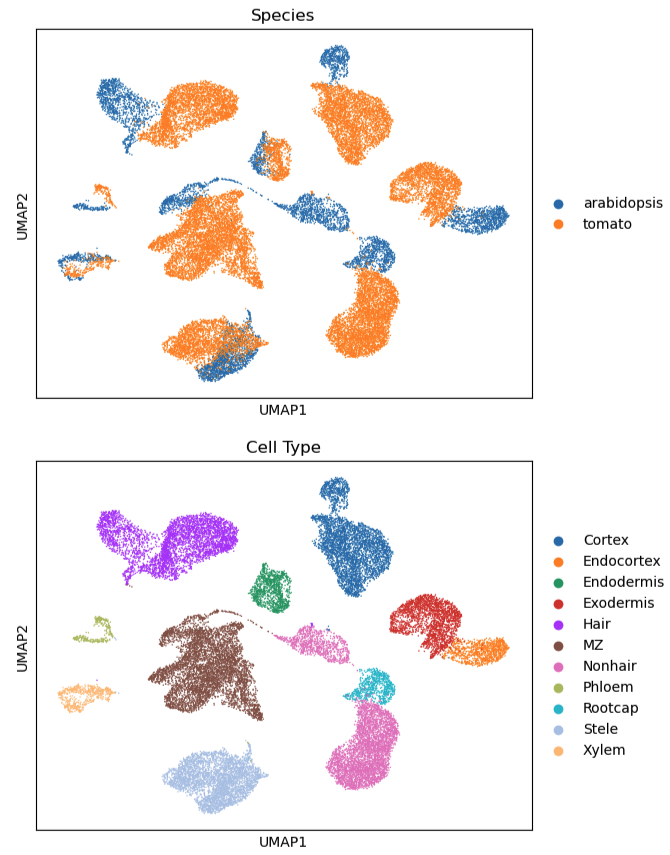

# Apply SATURN to Integrate Plant Single-Cell Data

This guide walks through applying SATURN to integrate Arabidopsis and Tomato single-cell RNA-seq datasets, using protein embeddings and expression profiles.

---

## 🔧 Setup Environment (Owl cluster)

```bash
module load Miniconda3/24.7.1-0
conda create -n saturn
source activate saturn

# Install packages
conda install python=3.10
pip install -r requirements.txt
pip install torch==1.10.2+cu113 -f https://download.pytorch.org/whl/cu113/torch_stable.html
pip install torch torchvision torchaudio --index-url https://download.pytorch.org/whl/cu118
```

---

## 📥 Download Repository and Prepare Data

```bash
cd /projects/intro2gds
# Clone SATURN repo
git clone https://github.com/snap-stanford/SATURN.git

# Create and navigate to proteome directory
cd SATURN/protein_embeddings
mkdir proteome
cd proteome
```

---

## 🧼 Clean FASTA Files

```bash
cd /projects/intro2gds/SATURN/protein_embeddings

# For Arabidopsis
python clean_fasta.py --data_path /projects/intro2gds/SATURN/protein_embeddings/proteome/Arabidopsis_thaliana.fa --save_path /projects/intro2gds/SATURN/protein_embeddings/proteome/Arabidopsis_thaliana.all_clean.fa

# For Tomato
python clean_fasta.py --data_path /projects/intro2gds/SATURN/protein_embeddings/proteome/Solanum_lycopersicum.fa --save_path /projects/intro2gds/SATURN/protein_embeddings/proteome/Solanum_lycopersicum.all_clean.fa
```

---

## ⚡ Extract ESM Embeddings (GPU Needed - Falcon cluster)

```bash
cd /projects/intro2gds/SATURN/protein_embeddings

# Submit to GPU cluster
sbatch test_slurm.sh
```
In in bash script file you will see
```bash
python /projects/intro2gds/SATURN/protein_embeddings/esm/scripts/extract.py \
esm1b_t33_650M_UR50S \
/projects/intro2gds/SATURN/protein_embeddings/proteome/Arabidopsis_thaliana.all_clean.fa \
/projects/intro2gds/SATURN/protein_embeddings/embeddings/Arabidopsis_thaliana.all_clean.fa_esm1b \
--include mean

python /projects/intro2gds/SATURN/protein_embeddings/esm/scripts/extract.py \
esm1b_t33_650M_UR50S \
/projects/intro2gds/SATURN/protein_embeddings/proteome/Solanum_lycopersicum.all_clean.fa \
/projects/intro2gds/SATURN/protein_embeddings/embeddings/Solanum_lycopersicum.all_clean.fa_esm1b \
--include mean
```

---

## 🔁 Map Gene Symbols to Protein IDs

```bash
# For Arabidopsis
python map_gene_symbol_to_protein_ids.py \
--fasta_path /projects/intro2gds/SATURN/protein_embeddings/proteome/Arabidopsis_thaliana.fa \
--save_path /projects/intro2gds/SATURN/protein_embeddings/proteome/Arabidopsis_thaliana.gene_symbol_to_protein_ID.json
```

```bash
# For Tomato
awk '/^>/ {id=substr($0,2); print ">" id " gene_symbol:" id; next} {print}' Solanum_lycopersicum.all_clean.fa > Solanum_lycopersicum.fa
python map_gene_symbol_to_protein_ids.py \
--fasta_path /projects/intro2gds/SATURN/protein_embeddings/proteome/Solanum_lycopersicum.fa \
--save_path /projects/intro2gds/SATURN/protein_embeddings/proteome/Solanum_lycopersicum.gene_symbol_to_protein_ID.json
```

---

## 🔄 Convert Protein to Gene Embeddings

```bash
# For Arabidopsis
python convert_protein_embeddings_to_gene_embeddings.py \
--embedding_dir /projects/intro2gds/SATURN/protein_embeddings/embeddings/Arabidopsis_thaliana.all_clean.fa_esm1b \
--gene_symbol_to_protein_ids_path /projects/intro2gds/SATURN/protein_embeddings/proteome/Arabidopsis_thaliana.gene_symbol_to_protein_ID.json \
--embedding_model ESM1b \
--save_path /projects/intro2gds/SATURN/protein_embeddings/embeddings/Arabidopsis_thaliana.gene_symbol_to_embedding_ESM1b.pt

# For Tomato
python convert_protein_embeddings_to_gene_embeddings.py \
--embedding_dir /projects/intro2gds/SATURN/protein_embeddings/embeddings/Solanum_lycopersicum.all_clean.fa_esm1b \
--gene_symbol_to_protein_ids_path /projects/intro2gds/SATURN/protein_embeddings/proteome/Solanum_lycopersicum.gene_symbol_to_protein_ID.json \
--embedding_model ESM1b \
--save_path /projects/intro2gds/SATURN/protein_embeddings/embeddings/Solanum_lycopersicum.gene_symbol_to_embedding_ESM1b.pt
```

---

## ⬇️ Optional: Downgrade Packages for Compatibility

```bash
pip install "numpy<2.0"
```

---

## 🧬 Prepare Gene Expression Data

**Expression CSV files:**
- `/projects/intro2gds/SATURN/data/Arabidopsis_anno.csv`
- `/projects/intro2gds/SATURN/data/Tomato_anno.csv`

**Script to convert CSV to AnnData:**
- `/projects/intro2gds/SATURN/data/AnnData_plant.py`

> Submit slurm job to run this file, just modify the AnnData.sh with the update python file `AnnData.sh`.

---

## 🗂️ Optional Cell Type Mapping, if we have the cell type annotation column

**Files:**
- `/projects/intro2gds/SATURN/data/arabidopsis_tomato_cell_type_map.csv`
- `/projects/intro2gds/SATURN/data/Arabidopsis_Tomato_mapping.Rmd`

---

## 📁 Create Saturn Input File

**File: `/projects/intro2gds/SATURN/data/Saturn_input.py`**

```python
import pandas as pd
df = pd.DataFrame(columns=["path", "species", "embedding_path"])
df["species"] = ["arabidopsis", "tomato"]
df["path"] = [ 
    "/projects/intro2gds/SATURN/data/arabidopsis.h5ad", 
    "/projects/intro2gds/SATURN/data/tomato.h5ad"
]
df["embedding_path"] = [ 
    "/projects/intro2gds/SATURN/protein_embeddings/embeddings/Arabidopsis_thaliana.gene_symbol_to_embedding_ESM1b.pt",
    "/projects/intro2gds/SATURN/protein_embeddings/embeddings/Solanum_lycopersicum.gene_symbol_to_embedding_ESM1b.pt"
]
df.to_csv("/projects/intro2gds/SATURN/data/arabidopsis_tomato_run.csv", index=False)
```

---

## 🚀 Run SATURN Integration

**File: `/projects/intro2gds/SATURN/data/Saturn_training.sh`**

```bash
python /projects/intro2gds/SATURN/train-saturn.py \ 
--in_data=/projects/intro2gds/SATURN/data/arabidopsis_tomato_run.csv \ 
--in_label_col=cell_type \ 
--ref_label_col=cell_type \ 
--num_macrogenes=2000 \ 
--hv_genes=8000 \ 
--centroids_init_path=/projects/intro2gds/SATURN/data/at_centroids.pkl \ 
--score_adatas \ 
--ct_map_path=/projects/intro2gds/SATURN/data/arabidopsis_tomato_cell_type_map.csv \ 
--work_dir=. \ 
--device=cuda \ 
--device_num=0
```

> ⏱ Estimated runtime: ~15 minutes

---

## 📊 Visualize Output with Jupyter Lab

Once training completes, use UMAP plots to visualize integrated data.
```bash
pip install scanpy 
import scanpy as sc
import pickle
adata = sc.read("/projects/intro2gds/SATURN/data/saturn_results/test256_data_arabidopsis_tomato_org_saturn_seed_0.h5ad")
sc.pp.pca(adata)
sc.pl.pca(adata, color="species", title="Species")
sc.pl.pca(adata, color="labels2", title="Cell Type")
sc.pp.neighbors(adata)
sc.tl.umap(adata)
sc.pl.umap(adata, color="species", title="Species")
sc.pl.umap(adata, color="labels2", title="Cell Type")
```

<!-- Original Markdown -->
<!--  -->

<!-- Updated with smaller size -->


## 📚 Citation

This guide is based on the publicly available SATURN framework:

Rosen, Y., Brbić, M., Roohani, Y., Swanson, K., Li, Z., & Leskovec, J. (2024). Toward universal cell embeddings: integrating single-cell RNA-seq datasets across species with SATURN. Nature Methods, 21(8), 1492-1500.
